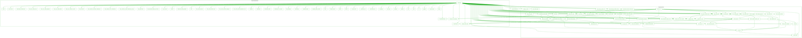

```mermaid
%%{init: {
    "theme": "base",
    "themeVariables": {
        "primaryColor": "#ffffff",
        "primaryTextColor": "#00a000",
        "primaryBorderColor": "#00a000",
        "lineColor": "#00a000",
        "textColor": "#00a000",
        "clusterBkg": "#ffffff",
        "clusterBorder": "#00a000"
    },
    "flowchart": {
        "htmlLabels": false,
        "useMaxWidth": false,
        "nodeSpacing": 40,
        "rankSpacing": 70,
        "curve": "basis"
    }
}}%%
flowchart TD
    FILE[rendering.py]
    FILE --> DOC[Top-level functions: 46]
    subgraph IMPORTS[Imported dependencies]
    BLUE[BLUE]
    FILE --> BLUE
    CirclePrimitive[CirclePrimitive]
    FILE --> CirclePrimitive
    DEV_COLOR[DEV_COLOR]
    FILE --> DEV_COLOR
    EMOTIONAL_COMPLEXES[EMOTIONAL_COMPLEXES]
    FILE --> EMOTIONAL_COMPLEXES
    EMX_CELL_GRID_COLS[EMX_CELL_GRID_COLS]
    FILE --> EMX_CELL_GRID_COLS
    EMX_CELL_GRID_ENABLED[EMX_CELL_GRID_ENABLED]
    FILE --> EMX_CELL_GRID_ENABLED
    EMX_CELL_GRID_ROWS[EMX_CELL_GRID_ROWS]
    FILE --> EMX_CELL_GRID_ROWS
    EMX_CELL_OVERLAY_ALPHA[EMX_CELL_OVERLAY_ALPHA]
    FILE --> EMX_CELL_OVERLAY_ALPHA
    EMX_COLORS[EMX_COLORS]
    FILE --> EMX_COLORS
    EMX_COMPLEX_SECOND_THRESHOLD[EMX_COMPLEX_SECOND_THRESHOLD]
    FILE --> EMX_COMPLEX_SECOND_THRESHOLD
    EMX_COMPLEX_TOP_THRESHOLD[EMX_COMPLEX_TOP_THRESHOLD]
    FILE --> EMX_COMPLEX_TOP_THRESHOLD
    EMX_COMPLEX_ZONE_THRESHOLD_SCALE[EMX_COMPLEX_ZONE_THRESHOLD_SCALE]
    FILE --> EMX_COMPLEX_ZONE_THRESHOLD_SCALE
    EMX_EMOTIONS[EMX_EMOTIONS]
    FILE --> EMX_EMOTIONS
    EMX_WEATHER_PANEL_SECTORS[EMX_WEATHER_PANEL_SECTORS]
    FILE --> EMX_WEATHER_PANEL_SECTORS
    FLEX_COLOR[FLEX_COLOR]
    FILE --> FLEX_COLOR
    FrameRenderPacket[FrameRenderPacket]
    FILE --> FrameRenderPacket
    HEIGHT[HEIGHT]
    FILE --> HEIGHT
    INSPECTOR_ZONE_ORDER[INSPECTOR_ZONE_ORDER]
    FILE --> INSPECTOR_ZONE_ORDER
    LIME[LIME]
    FILE --> LIME
    NPC_DYAD_COLORS[NPC_DYAD_COLORS]
    FILE --> NPC_DYAD_COLORS
    NPC_STATE_EXPORT_DIR[NPC_STATE_EXPORT_DIR]
    FILE --> NPC_STATE_EXPORT_DIR
    NPC_STATE_EXPORT_ENABLED[NPC_STATE_EXPORT_ENABLED]
    FILE --> NPC_STATE_EXPORT_ENABLED
    NPC_STATE_START_SNAPSHOT_TICK[NPC_STATE_START_SNAPSHOT_TICK]
    FILE --> NPC_STATE_START_SNAPSHOT_TICK
    ORANGE[ORANGE]
    FILE --> ORANGE
    PANTHEON[PANTHEON]
    FILE --> PANTHEON
    PANTHEON_TIERS[PANTHEON_TIERS]
    FILE --> PANTHEON_TIERS
    PERSONALITY_COLORS[PERSONALITY_COLORS]
    FILE --> PERSONALITY_COLORS
    RED_ORANGE[RED_ORANGE]
    FILE --> RED_ORANGE
    RectPrimitive[RectPrimitive]
    FILE --> RectPrimitive
    SHARED_ZONES[SHARED_ZONES]
    FILE --> SHARED_ZONES
    SHARED_ZONE_CONFIG[SHARED_ZONE_CONFIG]
    FILE --> SHARED_ZONE_CONFIG
    TEAL[TEAL]
    FILE --> TEAL
    TRADE_COLOR[TRADE_COLOR]
    FILE --> TRADE_COLOR
    WHITE[WHITE]
    FILE --> WHITE
    WIDTH[WIDTH]
    FILE --> WIDTH
    YELLOW_TEXT[YELLOW_TEXT]
    FILE --> YELLOW_TEXT
    CENTRAL_COL[_CENTRAL_COL]
    FILE --> CENTRAL_COL
    PANTHEON_COL[_PANTHEON_COL]
    FILE --> PANTHEON_COL
    annotations[annotations]
    FILE --> annotations
    color_map[color_map]
    FILE --> color_map
    compute_anchor_field[compute_anchor_field]
    FILE --> compute_anchor_field
    compute_emx_archetype[compute_emx_archetype]
    FILE --> compute_emx_archetype
    constants[constants]
    FILE --> constants
    datetime[datetime]
    FILE --> datetime
    json[json]
    FILE --> json
    math[math]
    FILE --> math
    os[os]
    FILE --> os
    pygame[pygame]
    FILE --> pygame
    render_central[render_central]
    FILE --> render_central
    tuning[tuning]
    FILE --> tuning
    end
    subgraph FUNCTIONS[Top-level functions]
    draw_anchor_fields[draw_anchor_fields]
    FILE --> draw_anchor_fields
    configure_runtime[configure_runtime]
    FILE --> configure_runtime
    runtime_state[_runtime_state]
    FILE --> runtime_state
    env_state[_env_state]
    FILE --> env_state
    sim_state[_sim_state]
    FILE --> sim_state
    stable_phase_seed[_stable_phase_seed]
    FILE --> stable_phase_seed
    build_anchor_field_primitives[_build_anchor_field_primitives]
    FILE --> build_anchor_field_primitives
    build_atmosphere_halo_primitives[_build_atmosphere_halo_primitives]
    FILE --> build_atmosphere_halo_primitives
    build_npc_primitives[_build_npc_primitives]
    FILE --> build_npc_primitives
    draw_circle_primitives_software[_draw_circle_primitives_software]
    FILE --> draw_circle_primitives_software
    build_frame_render_packet[build_frame_render_packet]
    FILE --> build_frame_render_packet
    draw_atmosphere[draw_atmosphere]
    FILE --> draw_atmosphere
    draw_atmosphere_indicators[draw_atmosphere_indicators]
    FILE --> draw_atmosphere_indicators
    draw_npcs[draw_npcs]
    FILE --> draw_npcs
    draw_anchors[draw_anchors]
    FILE --> draw_anchors
    draw_statistics_dashboard[draw_statistics_dashboard]
    FILE --> draw_statistics_dashboard
    draw_npc_inspector[draw_npc_inspector]
    FILE --> draw_npc_inspector
    draw_alpha_rect[draw_alpha_rect]
    FILE --> draw_alpha_rect
    draw_atmosphere_legend_corner[draw_atmosphere_legend_corner]
    FILE --> draw_atmosphere_legend_corner
    save_npc_state[save_npc_state]
    FILE --> save_npc_state
    reset_runtime_state[reset_runtime_state]
    FILE --> reset_runtime_state
    save_start_npc_state_once[save_start_npc_state_once]
    FILE --> save_start_npc_state_once
    resolve_weather_timeline_zone[resolve_weather_timeline_zone]
    FILE --> resolve_weather_timeline_zone
    compute_zone_sector_weather[compute_zone_sector_weather]
    FILE --> compute_zone_sector_weather
    draw_corner_panels[draw_corner_panels]
    FILE --> draw_corner_panels
    draw_emx_panel[draw_emx_panel]
    FILE --> draw_emx_panel
    draw_weather_panel[draw_weather_panel]
    FILE --> draw_weather_panel
    draw_cell_grid_overlay[draw_cell_grid_overlay]
    FILE --> draw_cell_grid_overlay
    draw_tuning_panel[draw_tuning_panel]
    FILE --> draw_tuning_panel
    snapshot_wrap[_snapshot_wrap]
    FILE --> snapshot_wrap
    snapshot_line_color[_snapshot_line_color]
    FILE --> snapshot_line_color
    format_zone_distribution[_format_zone_distribution]
    FILE --> format_zone_distribution
    format_zone_complexes[_format_zone_complexes]
    FILE --> format_zone_complexes
    build_snapshot_lines[_build_snapshot_lines]
    FILE --> build_snapshot_lines
    draw_game_snapshot_panel[draw_game_snapshot_panel]
    FILE --> draw_game_snapshot_panel
    draw_controls_panel[draw_controls_panel]
    FILE --> draw_controls_panel
    compact_world_tab_label[_compact_world_tab_label]
    FILE --> compact_world_tab_label
    view_tab_color[_view_tab_color]
    FILE --> view_tab_color
    build_vertical_edge_tabs[_build_vertical_edge_tabs]
    FILE --> build_vertical_edge_tabs
    build_edge_tabs[_build_edge_tabs]
    FILE --> build_edge_tabs
    draw_edge_tabs[draw_edge_tabs]
    FILE --> draw_edge_tabs
    build_horizontal_scrollbar_metrics[build_horizontal_scrollbar_metrics]
    FILE --> build_horizontal_scrollbar_metrics
    horizontal_scroll_from_thumb_left[horizontal_scroll_from_thumb_left]
    FILE --> horizontal_scroll_from_thumb_left
    resolve_edge_tab_action[resolve_edge_tab_action]
    FILE --> resolve_edge_tab_action
    render_view[render_view]
    FILE --> render_view
    draw_load_menu[draw_load_menu]
    FILE --> draw_load_menu
    end
    draw_anchor_fields --> build_anchor_field_primitives
    draw_anchor_fields --> draw_circle_primitives_software
    env_state --> runtime_state
    sim_state --> runtime_state
    build_anchor_field_primitives --> CirclePrimitive
    build_anchor_field_primitives --> stable_phase_seed
    build_anchor_field_primitives --> compute_anchor_field
    build_atmosphere_halo_primitives --> CirclePrimitive
    build_atmosphere_halo_primitives --> env_state
    build_npc_primitives --> CirclePrimitive
    build_frame_render_packet --> FrameRenderPacket
    build_frame_render_packet --> build_anchor_field_primitives
    build_frame_render_packet --> build_atmosphere_halo_primitives
    build_frame_render_packet --> build_npc_primitives
    draw_atmosphere --> build_atmosphere_halo_primitives
    draw_atmosphere --> draw_circle_primitives_software
    draw_atmosphere --> draw_atmosphere_indicators
    draw_atmosphere_indicators --> env_state
    draw_npcs --> build_npc_primitives
    draw_npcs --> draw_circle_primitives_software
    draw_atmosphere_legend_corner --> env_state
    draw_atmosphere_legend_corner --> draw_alpha_rect
    save_start_npc_state_once --> save_npc_state
    resolve_weather_timeline_zone --> env_state
    draw_corner_panels --> draw_alpha_rect
    draw_corner_panels --> draw_atmosphere_legend_corner
    draw_emx_panel --> compute_emx_archetype
    draw_weather_panel --> env_state
    draw_weather_panel --> compute_zone_sector_weather
    draw_weather_panel --> resolve_weather_timeline_zone
    draw_cell_grid_overlay --> env_state
    format_zone_complexes --> env_state
    build_snapshot_lines --> format_zone_complexes
    build_snapshot_lines --> format_zone_distribution
    build_snapshot_lines --> sim_state
    draw_game_snapshot_panel --> build_snapshot_lines
    draw_game_snapshot_panel --> snapshot_line_color
    draw_game_snapshot_panel --> snapshot_wrap
    build_edge_tabs --> build_vertical_edge_tabs
    build_edge_tabs --> compact_world_tab_label
    build_edge_tabs --> view_tab_color
    draw_edge_tabs --> build_edge_tabs
    resolve_edge_tab_action --> build_edge_tabs
    render_view --> runtime_state
    render_view --> draw_anchor_fields
    render_view --> draw_anchors
    render_view --> draw_atmosphere
    render_view --> draw_atmosphere_indicators
    render_view --> draw_cell_grid_overlay
    render_view --> draw_controls_panel
    render_view --> draw_corner_panels
    render_view --> draw_edge_tabs
    render_view --> draw_emx_panel
    render_view --> draw_game_snapshot_panel
    render_view --> draw_load_menu
    render_view --> draw_npc_inspector
    render_view --> draw_npcs
    render_view --> draw_statistics_dashboard
    render_view --> draw_tuning_panel
    render_view --> draw_weather_panel
```
